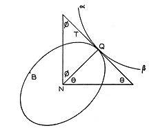
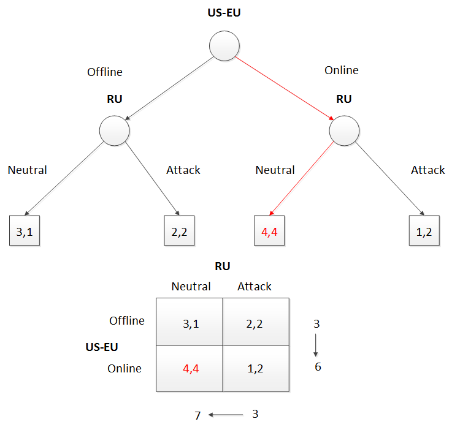

---
output:
  pdf_document: default
  html_document: default
---
#"Nash equilibrium: a case study"

---
output:
  pdf_document:
    toc: yes
  html_document:
    toc: yes
---


*************************
*author: "Alexander Levakov"*

*date: "March, 2015"*


> In a dream it's typical not to be rational.
  
*John Forbes Nash, Jr.*


##Nash equilibrium



In game theory, the Nash equilibrium is a solution concept of a non-cooperative game involving two or more players, in which each player is assumed to know the equilibrium strategies of the other players, and no player has anything to gain by changing only their own strategy. If each player has chosen a strategy and no player can benefit by changing strategies while the other players keep theirs unchanged, then the current set of strategy choices and the corresponding payoffs constitutes a Nash equilibrium.

See: http://en.wikipedia.org/wiki/John_Forbes_Nash,_Jr.


##Case of interest
For demonstrating the Nash equilibrium we use **Bloomberg** story about SWIFT : http://www.Bloomberg.com/news/articles/2015-03-19/russian-cutoff-from-bank-backbone-said-to-be-ruled-out-as-option



##Problem
We want to find Nash equilibrium for this game (see above), where:
4-best option, 3-next best option, 2-least best option, 1–worst option. We have non-zero sum game.

```{r}
US <- matrix(c(3,2,4,1),nrow=2,byrow=T)
RU <- matrix(c(1,2,4,2),nrow=2,byrow=T)

```


```{r}
US
RU
```

##Dominant strategies
###US-EU
```{r}
US.1<-sum(US[,1])
US.2<-sum(US[,2])
US.1
US.2
max(US.1,US.2)

```

###RU
```{r}
RU.1<-sum(RU[1,])
RU.2<-sum(RU[2,])
RU.1
RU.2
max(RU.1,RU.2)
```
##Equilibrium of game 
Nash Equilibrium for this game $(4,4)$ sounds like this: **US and EU provide SWIFT online capability for RU while RU keeps neutral about possible cyber attack against US and EU unless SWIFT is cutoff**.

```{r}

```

##Conclusions
**1**.Any game with numbers is of a real interest and practice for decision makers provided they acknowledge Nash equilibrium as a method for negotiations and bargains in mutual interests.

**2**.In fact this particular game could be used for any West-East existing problem (economic sanctions, oil prices - https://rpubs.com/alex-lev/50128,  BMD - https://rpubs.com/alex-lev/42458, etc.) in a broader aspect of relations.

> You don't have to be a mathematician to have a feel for numbers.

*John Forbes Nash, Jr.*


